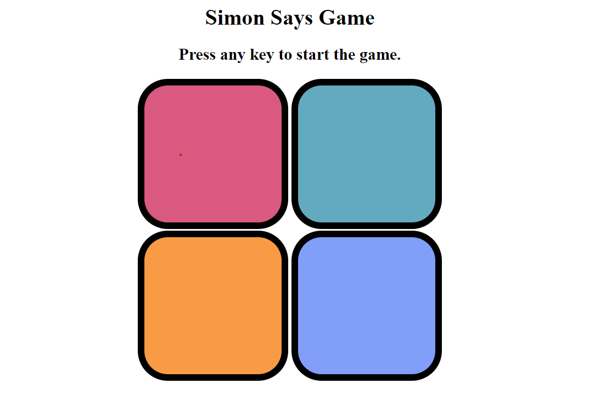
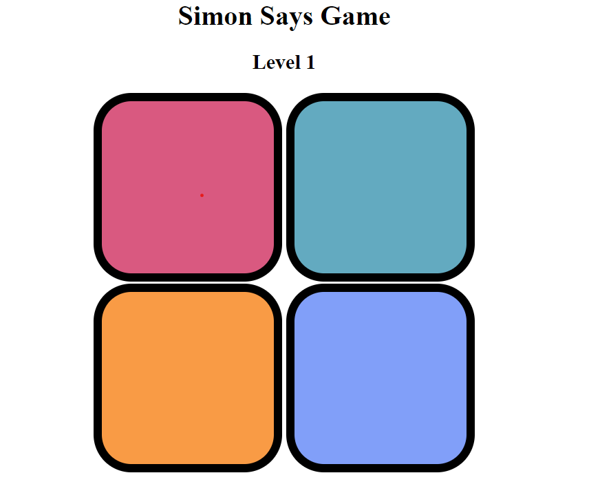
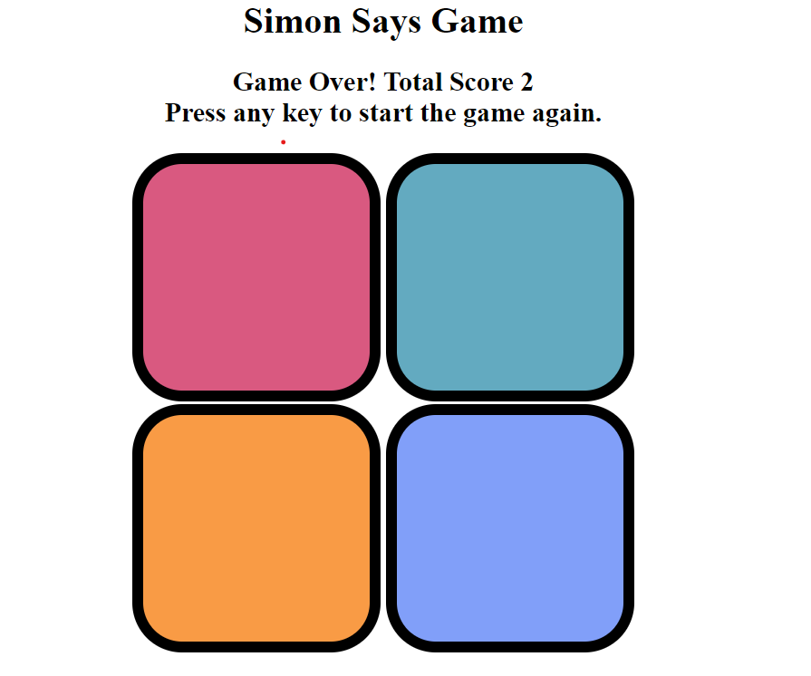

# Simon Says Game

This project is a simple implementation of the classic Simon Says memory game using HTML, CSS, and JavaScript.

## How to Play

1. Open the `index.html` file in your web browser.
2. Press any key to start the game.
3. Watch the sequence of colors highlighted by the game.
4. Repeat the sequence by clicking on the corresponding colored buttons.
5. The game will continue to add new colors to the sequence after each successful round.
6. The game ends when the player makes a mistake in repeating the sequence.

## Controls

- Click on the colored buttons (red, yellow, green, purple) to repeat the sequence.
- Press any key to start the game.

## Files

- `index.html`: HTML file containing the structure of the game.
- `style.css`: CSS file containing styles for the game interface.
- `app.js`: JavaScript file containing the game logic.

## Preview

### Before start the game

### After start the game

### When commits mistake while pressing write sequence

## Credits

This project was inspired by the classic Simon Says game.

